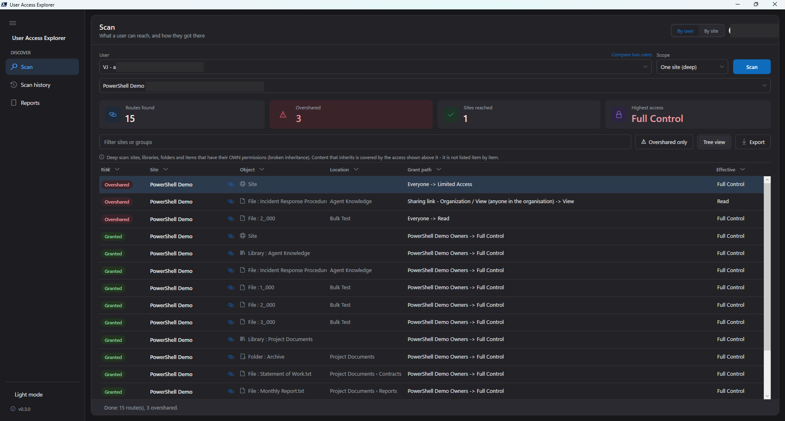
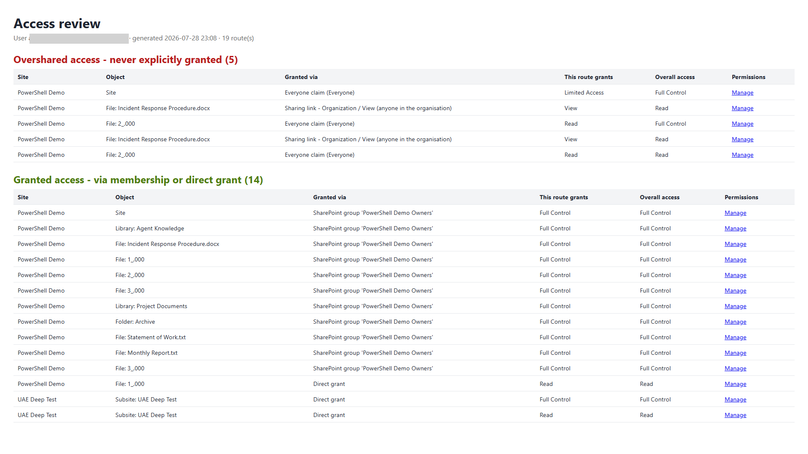
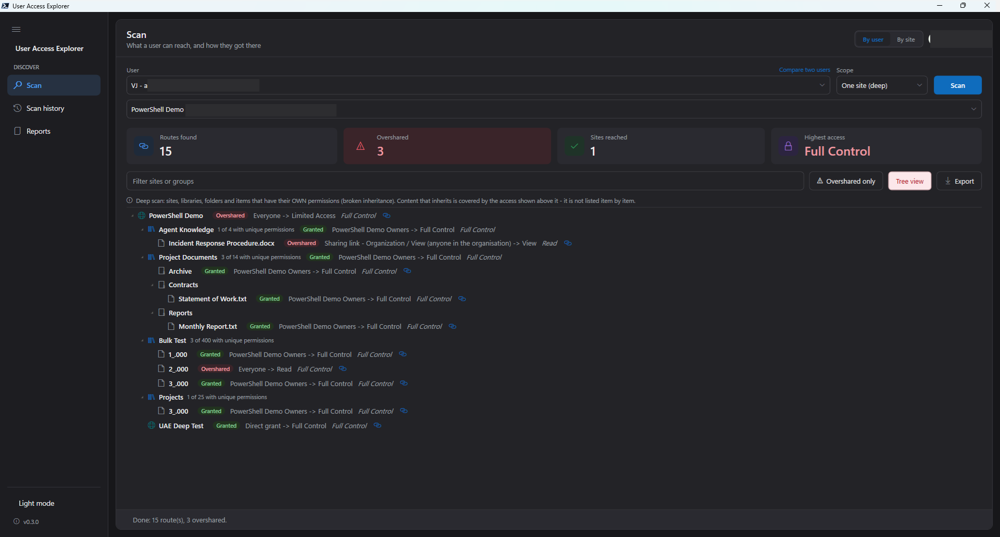
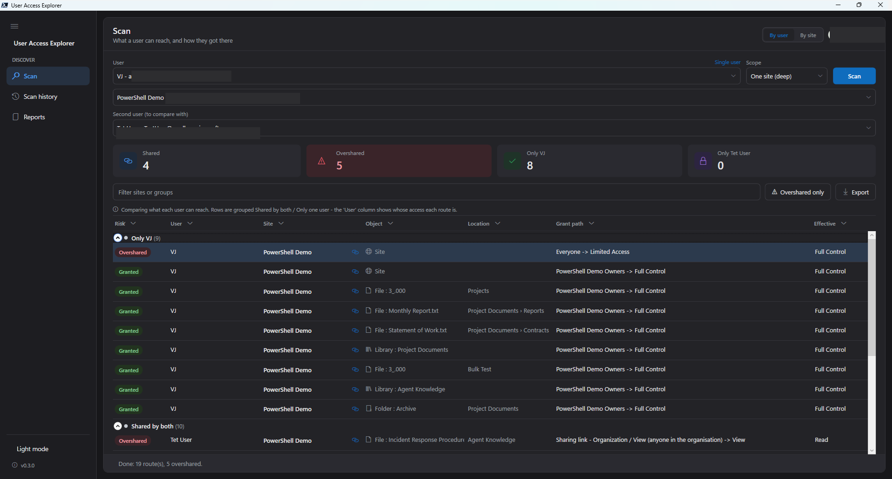
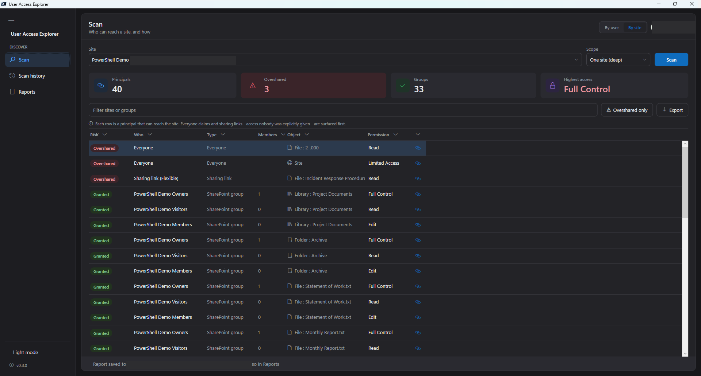

# User Access Explorer

**See what a user can actually reach across SharePoint Online, and *how*, so the access they were never explicitly given stands out.**

Pick a user and User Access Explorer reports everything they can reach, **grouped by route** and classified:

- **Granted**. Access through a route they belong to: a direct grant, a SharePoint group they're a member of, or an Entra group.
- **Overshared**. Access they were *never explicitly given*: an **Everyone / Everyone-except-external claim** or a **sharing link**, i.e. exactly the kind of oversharing Microsoft 365 Copilot will happily surface. ("Overshared" is Microsoft's own term for this in the Copilot / SharePoint Advanced Management governance reports.)

Overshared routes are surfaced **first**. That grouping is the whole point of the tool: *"what can this user see that they probably shouldn't, and why?"*

This is a **Copilot-readiness / oversharing review** tool for admins.



A step-by-step walkthrough is on the blog:
[User Access Explorer: see what a user can really reach in SharePoint](https://www.fivenumber.com/user-access-explorer/).

---

## Permissions the app needs

Reading a site's permissions is an **admin** operation. A Contributor cannot see this. Register (or reuse) an Entra ID app and grant it:

| Scope | Why | Type |
|---|---|---|
| **Sites.FullControl.All** (SharePoint) | read role assignments and broken inheritance on sites, lists and items | delegated or application |
| **User.ReadBasic.All** (Microsoft Graph) | the User box's search-as-you-type directory lookup | delegated |
| **GroupMember.Read.All** (Microsoft Graph) | confirm a user is really in an Entra/M365 group (transitively) before listing that route | delegated |

Run it as a **SharePoint / Global Administrator**: permission reads need Full Control, and tenant-wide scans enumerate every site.

> The two Graph scopes are optional-but-recommended. Without **User.ReadBasic.All**, user search fails. You can still type the full email (`jane@contoso.com`) and Scan. Without **GroupMember.Read.All**, group routes can't be confirmed and are shown as `Entra group '…' (membership unconfirmed)` rather than dropped/confirmed. The tool degrades gracefully in both cases.

---

## Two ways to run it

| | For | Entry point |
|---|---|---|
| **PowerShell module** | scripting, pipelines, scheduled reports | `Get-UserAccess`, `Export-UserAccessReport` |
| **Desktop app (GUI)** | point-and-click review | `gui/Show-UserAccessExplorer.ps1` |

Both sit on the same engine.

---

## Requirements

- **PowerShell 7.2+** (the module is PS7-only; the GUI hosts WPF in a PS7 STA runspace).
- **[PnP.PowerShell](https://pnp.github.io/powershell/) 2.12.0+**
- An **Entra ID app registration** (client ID) you can sign in with interactively, or a certificate/app-only identity.
- **Full Control** on any site you report on. Reading a site's permissions is *not* something a Contributor can do. Run as a **Site Owner / Site Collection Admin**, or with an app that has the rights.
  - Tenant-wide needs **`Sites.FullControl.All`** app-only, because a tenant admin is not automatically Site Collection Admin on every site.

Everything the tool does is **read-only**.

---

## Install

Clone the repo and import the module (no PowerShell Gallery dependency):

```powershell
git clone https://github.com/gvijaikumar9/UserAccessExplorer.git
cd UserAccessExplorer
Import-Module .\UserAccessExplorer.psd1 -Force     # the Get-UserAccess / Export-UserAccessReport cmdlets
```

To launch the desktop app instead:

```powershell
pwsh -File .\gui\Show-UserAccessExplorer.ps1        # or right-click > Run with PowerShell 7
```

Make sure **[PnP.PowerShell](https://pnp.github.io/powershell/) 2.12.0+** is installed (`Install-Module PnP.PowerShell`). It's the module's one dependency.

> Not on the PowerShell Gallery (yet). Installing from this repo is the supported path.

## Usage: module

**One site:**

```powershell
Get-UserAccess -User jane@contoso.com `
    -SiteUrl "https://contoso.sharepoint.com/sites/Sales" `
    -ClientId $appId -Interactive
```

**Several sites:**

```powershell
Get-UserAccess -User jane@contoso.com -SiteUrls $sites -UseExistingConnection
```

**Whole tenant, worst routes first:**

```powershell
Get-UserAccess -User jane@contoso.com -TenantWide `
    -TenantAdminUrl "https://contoso-admin.sharepoint.com" `
    -ClientId $appId -Interactive
```

**Only the access they were never explicitly given:**

```powershell
Get-UserAccess -User jane@contoso.com -TenantWide `
    -TenantAdminUrl "https://contoso-admin.sharepoint.com" `
    -ClientId $appId -Interactive -OversharedOnly
```

**Go deep into subsites, lists, and individual files:**

```powershell
# All the way down, including documents Jane can open through a sharing link
# she was never granted (invisible to a normal permission check)
Get-UserAccess -User jane@contoso.com -SiteUrl $site -ClientId $appId -Interactive `
    -Deep -IncludeItems -OversharedOnly
```

`-Deep` walks subsites and any list/library with its own permissions; add
`-IncludeItems` to descend to individual files and items. Only objects that
**break inheritance** are examined. Everything else already has its parent's
answer, so the cost is proportional to how much a site has been *shared*, not
to how big it is. `-MaxItemsPerList N` caps very large lists (a warning names any
list it truncates, so partial results are never silent).

Deep scans also surface **sharing links**, which a normal scan cannot: an
organization-wide link grants no per-user permission at all, so it is invisible
to "what can this user do here". It is found by asking what links an object
carries and whether the user falls inside the link's audience. Because each
shared file is a separate Graph lookup, deep scans are slow, so run them on sites
you care about, not across a whole tenant.

**Who can reach a site, the mirror question:** `Get-SiteAccess` fixes a *site*
and reports every principal that can reach it: a user, a SharePoint group, an
Entra group, an Everyone claim, or a sharing link, each classified **Granted**
or **Overshared**, with groups expanded to a member count.

```powershell
Get-SiteAccess -SiteUrl $site -ClientId $appId -Interactive -Deep -OversharedOnly

# -ExpandMembers turns each group into one row per person -
# the full list of who can actually reach it
Get-SiteAccess -SiteUrl $site -ClientId $appId -Interactive -ExpandMembers
```

It uses the same broken-inheritance `-Deep -IncludeItems` walk and the same
incomplete-scan signalling as `Get-UserAccess`. Entra-group member counts come
from Graph (`GroupMember.Read.All`). Rows carry `Principal`, `PrincipalType`
(User / SharePointGroup / EntraGroup / Everyone / SharingLink), `MemberCount`,
`Permission`, `RouteType`, and the object/`PermUrl` fields.

**Export a report** (self-contained HTML, Overshared section first, or CSV):

```powershell
Get-UserAccess -User jane@contoso.com -TenantWide -TenantAdminUrl $admin -ClientId $appId -Interactive |
    Export-UserAccessReport -Path .\jane-access.html -Html

# CSV instead:
... | Export-UserAccessReport -Path .\jane-access.csv
```

The HTML report is self-contained and leads with the Overshared section:



### What each row tells you

| Column | Meaning |
|---|---|
| `RouteType` | **Granted** or **Overshared** |
| `SiteTitle` / `SiteUrl` | the site |
| `GrantedVia` | the route: `Direct grant`, `SharePoint group '...'`, `Entra group '...'`, `Everyone claim (...)`, or `Sharing link (...)` |
| `Permission` | what **this route** grants (e.g. `Read`, `Edit`) |
| `EffectiveAccess` | the user's **overall** effective access on the site |
| `PermUrl` | direct link to the object's **advanced-permissions page**, where the access is managed |

With `-Deep`, rows also carry `ObjectType` (Web / List / Item), `ObjectKind` (Site / Subsite / Library / List / Folder / File / Item), `ObjectTitle`, `ObjectUrl`, `PermUrl`, and a few default metadata columns (name, path, modified/created, author/editor, and size for library items).

---

## Usage: desktop app (GUI)

```powershell
pwsh -File .\gui\Show-UserAccessExplorer.ps1
```

*(or right-click → Run with PowerShell 7)*

1. **Connect**. The settings popup (gear, top right) opens on launch. Enter your app **Client ID** and **Tenant admin URL** and click Connect (one interactive sign-in). The tenant chip turns green when connected.
2. **Pick a user**. Type a name or email in the **User** box; it searches the directory as you type. Pick a match.
3. **Choose scope**. Pick *Whole tenant*, *One site*, or *One site (deep)* (the site box becomes a **searchable list of your tenant's sites**, pick one rather than typing a URL), then **Scan**. A count-based progress bar shows "site N of M", and **Stop** cancels a running scan.

Results are a **sortable, groupable grid**. One row per route, with the **Overshared** ones grouped to the top and each grant path shown with its route (`Everyone claim → read`, `Sharing link → view`, and so on). Click a column header to sort; use the header chevron to group or filter by any column. Four tiles summarize the whole scan at a glance: Routes found, **Overshared**, Sites reached, Highest access. Filter with the search box, flip **Overshared only** to see just the risky routes, switch to the **Tree view** to see the Site → Library → Folder → Item hierarchy (single-user deep scans), and **Export** to HTML or CSV. Every object row (and tree node) has an **open-permissions button** that jumps straight to that object's **advanced-permissions page** in SharePoint (site / list / item). For an item that carries a sharing link, that page also shows the link and a **"manage links"** action, so it's the one-click route to revoke.

The **Tree view** shows the same deep scan as a Site → Library → Folder → Item hierarchy, so you can see exactly where in the site the risky access sits:



**Compare two users.** Switch the **Single user** control to add a second user, and the scan runs both, then diffs them: rows are grouped **Shared by both**, **Only** the first user, and **Only** the second, with a **User** column showing whose access each route is, and the tiles switch to Shared / Only-A / Only-B counts. Good for "give the new starter the same access as her manager". You see exactly where the two differ before copying anything. Compare runs are saved to Scan history like any other. (The Tree view is hidden in compare mode; a hierarchy can't express a two-user diff.)



**By user or by site.** The header has a **By user / By site** toggle. *By site* flips the subject: pick a **site** instead of a user, and every row becomes a **principal that can reach it**, with **Who** (the principal), **Type** (SharePoint group / Entra group / Everyone / Sharing link / User), **Members** (the group's member count), **Permission**, and a **Manage** button, Overshared-first. Run it *deep* and it walks down to the subsites, libraries and files with their own permissions, so a document shared with **Everyone** three folders down gets its own row. Tiles switch to **Principals / Overshared / Groups / Highest access**. By-site scans save to Scan history too (each history card is badged **By site** or **By user**).



The scan runs on a background runspace so the window stays responsive on tenant-wide sweeps.

**Scan history.** Every completed scan is saved automatically (to `%AppData%\UserAccessExplorer\scans`). The **Scan history** view in the nav rail lists your recent scans, each showing the user, scope, and the site it covered, so you can **reload one instantly**, no SharePoint round-trip. Reloaded results are clearly stamped with when they were taken, and **Scan always re-runs live**, so a cached view is never mistaken for current permissions.

The app has a **collapsible left navigation rail** with *Scan* (the main view) and *Scan history*, plus a **light/dark theme** toggle at the bottom (remembered between sessions). Connection settings open from the **gear** (top right), which also has an **About** panel showing the version, a **Check for updates** button (against GitHub Releases), and a link to the guide.

> **Notes**
> - WPF requires STA and PowerShell 7 is MTA by default, so the GUI runs itself inside a manually-created STA runspace. The engine is PS7-only, so it cannot fall back to Windows PowerShell 5.1.
> - The GUI does **deep** scanning too. Pick *One site (deep)* to walk subsites, lists, folders, items and sharing links, and use the **Tree view** to see the structure.

---

## How it works

For each site the engine:

1. Calls `Web.GetUserEffectivePermissions` (CSOM) → the **definitive** answer to *can they, and at what level*. Sites where the level is `None` are skipped.
2. Walks the site's **role assignments** to attribute that access to routes: direct grant, SharePoint group membership, Entra group, or an **Everyone claim** (detected from the principal's login/title).
3. Classifies each route **Granted** vs **Overshared** and emits one row per route.

Tenant-wide enumeration skips redirect stubs and the OneDrive/MySite host (not content sites). Every PnP call is wrapped in retry-with-backoff that honours `Retry-After` on throttling (429/503).

If a site still cannot be read after retries, it is skipped (with a warning) rather than aborting the whole scan, and `Get-UserAccess` writes a **non-terminating error** (`FullyQualifiedErrorId` `UserAccessExplorer.IncompleteScan`). That lets you tell a genuine *"no access"* from a scan that simply could not reach some sites. Capture it with `-ErrorVariable` and treat the results as partial:

```powershell
$rows = Get-UserAccess -User jane@contoso.com -TenantWide -TenantAdminUrl $admin `
            -ClientId $id -Interactive -ErrorVariable skips
if ($skips | Where-Object FullyQualifiedErrorId -match 'IncompleteScan') {
    Write-Warning "Results are incomplete - some sites could not be read."
}
```

**Going deep** (`-Deep`) extends the same idea below the site. It walks subsites, then only the lists and items that **break inheritance**. The rest inherit their parent's answer, so it never evaluates every item. For each such object it asks two independent questions: *what can this user do here* (direct grants, groups, Everyone claims) and *what sharing links does it carry, and is this user in the audience*. The second is how link-based oversharing, which grants no per-user permission, is found. Effective-permission checks are batched into single round trips to keep item-level affordable.

---

## Project layout

```
UserAccessExplorer.psd1 / .psm1     module manifest + loader
Public/
  Get-UserAccess.ps1                main cmdlet (Site / Sites / Tenant param sets)
  Export-UserAccessReport.ps1       HTML (Overshared-first) / CSV export
Private/
  Get-UserAccessForSite.ps1         the per-site engine
  Test-Principal.ps1                Everyone-claim / system-group detection, claim login
  Connect-IfNeeded.ps1              connect helper
  Invoke-WithRetry.ps1              throttle-aware retry
gui/
  Show-UserAccessExplorer.ps1       WPF desktop app over the module
tests/
  UserAccessExplorer.Tests.ps1      Pester tests
```

## Development

```powershell
Invoke-Pester ./tests
Invoke-ScriptAnalyzer -Path . -Recurse -Severity Warning,Error
```

`dev/` holds live integration harnesses that hardcode a real tenant + client ID. It is git-ignored and never shipped.

## License

MIT. See [LICENSE](LICENSE).
